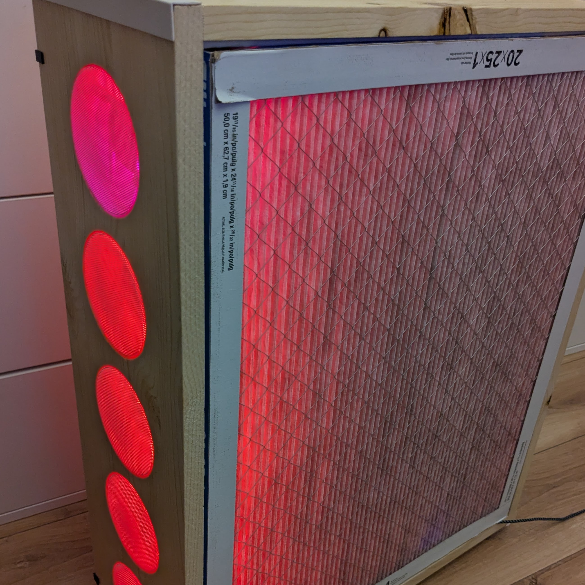
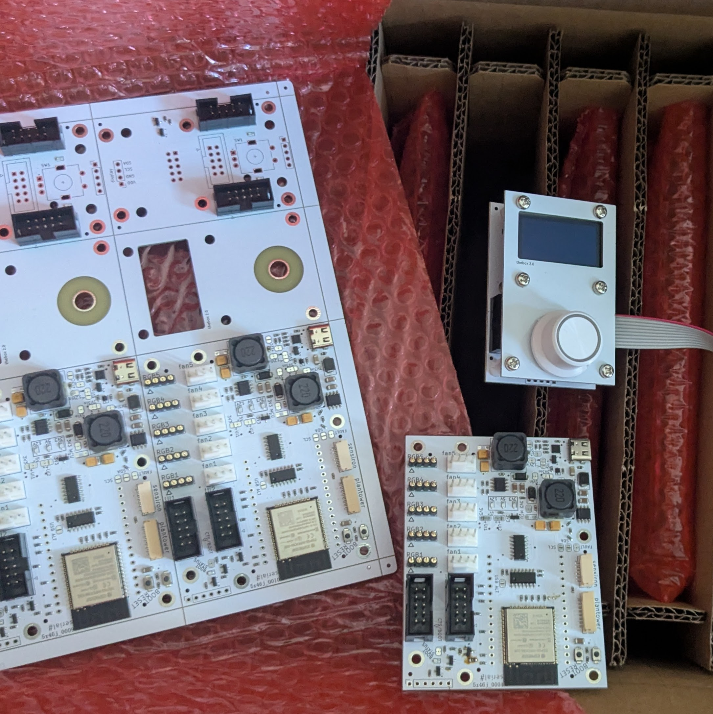
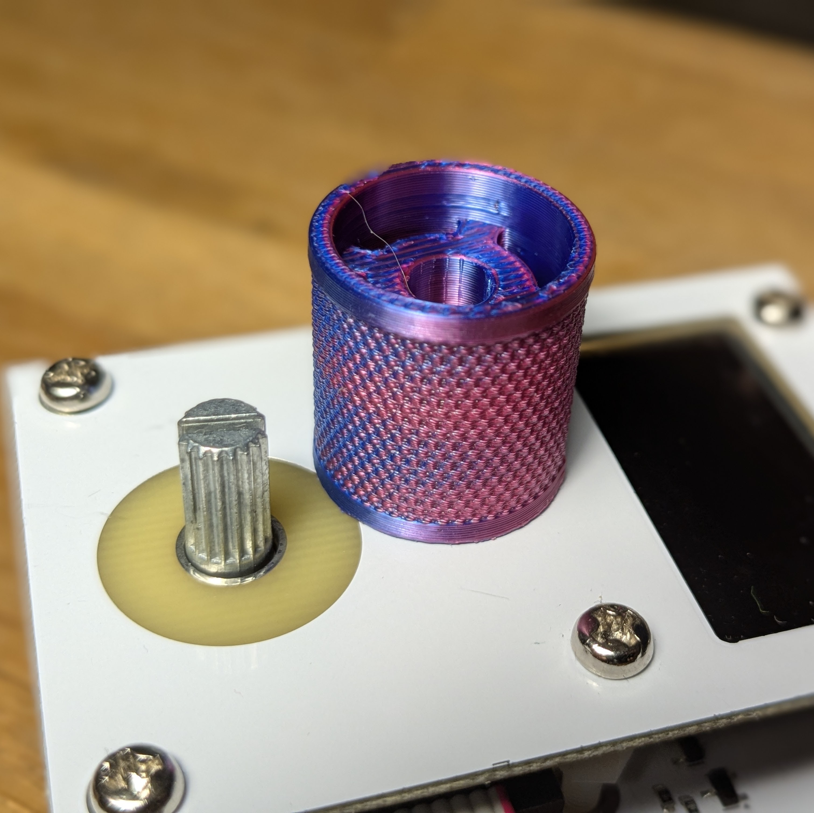
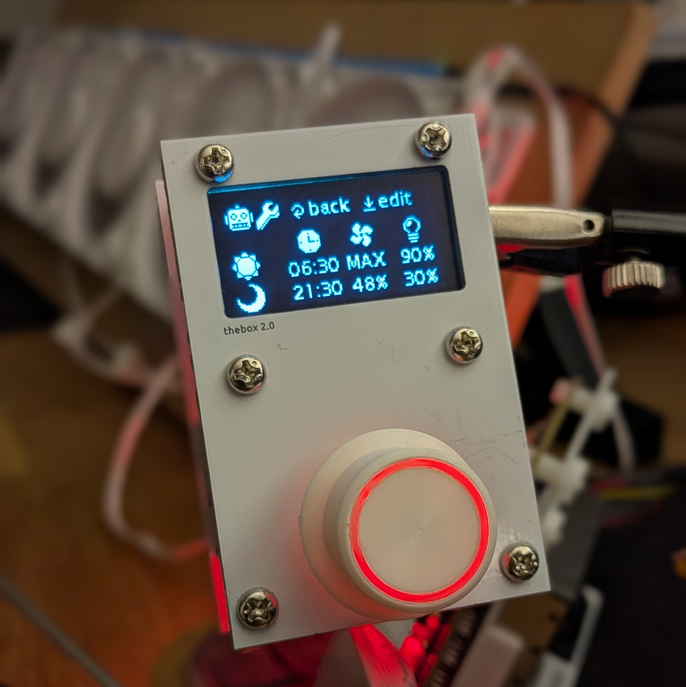
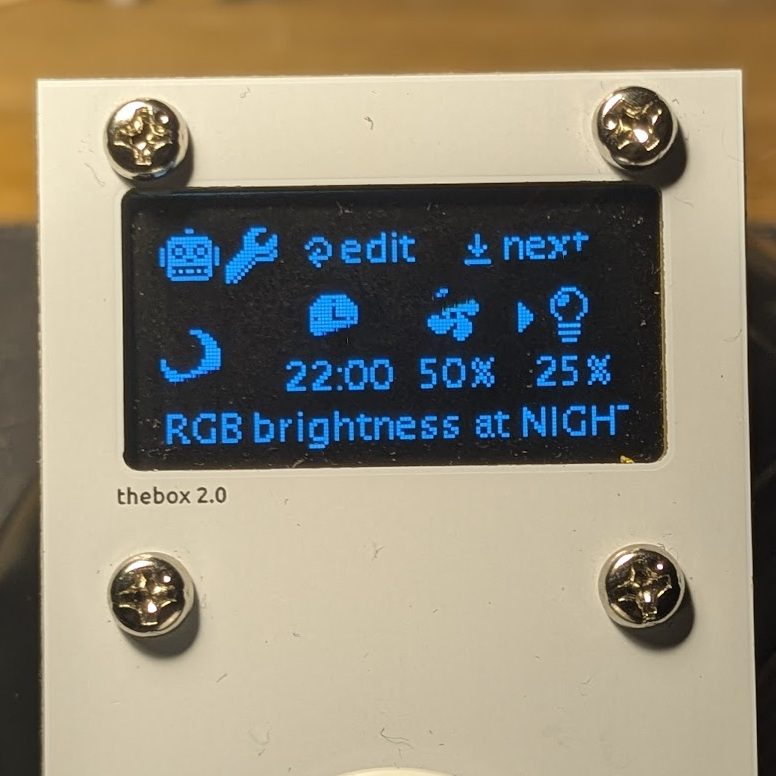

# home

## overview

*thecrbox* is ready to use, drop-in hardware platform which converts a regular *CR box* to a *smart air purifier*

{ width="128" }
{ width="128" }
{ width="128" }
{ width="128" }
{ width="128" }

## project status

We're currently in the process of releasing diagrams and basic firmware for *thecrbox*.

A small test-batch of pre-assembled devices is currently ready to be shipped, and will be mada available
as soon as WiFi-provisioning and OTA will be tested.

## resources

- [schematics](https://github.com/thecrbox/hardware)
- [reference firmware](https://github.com/thecrbox/firmware)
- [this docs](https://github.com/thecrbox/docs)
