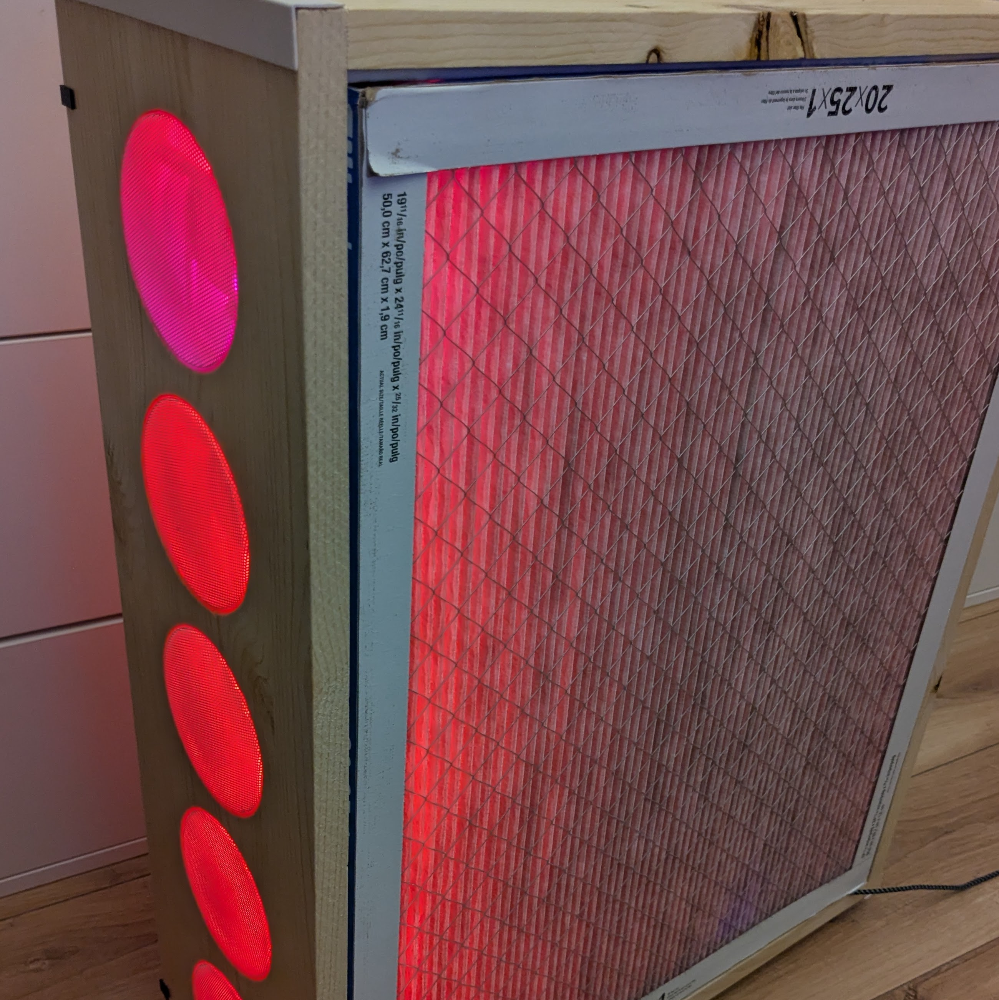
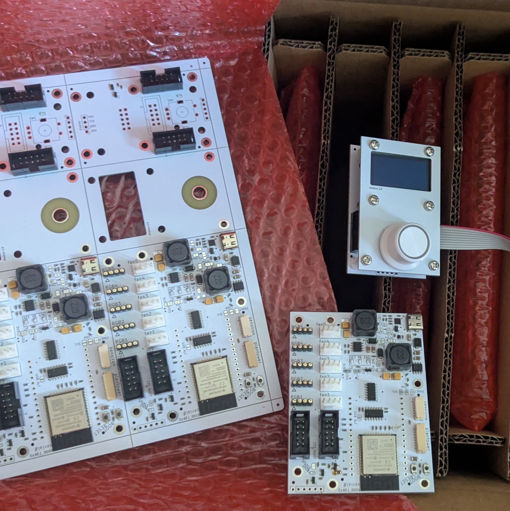
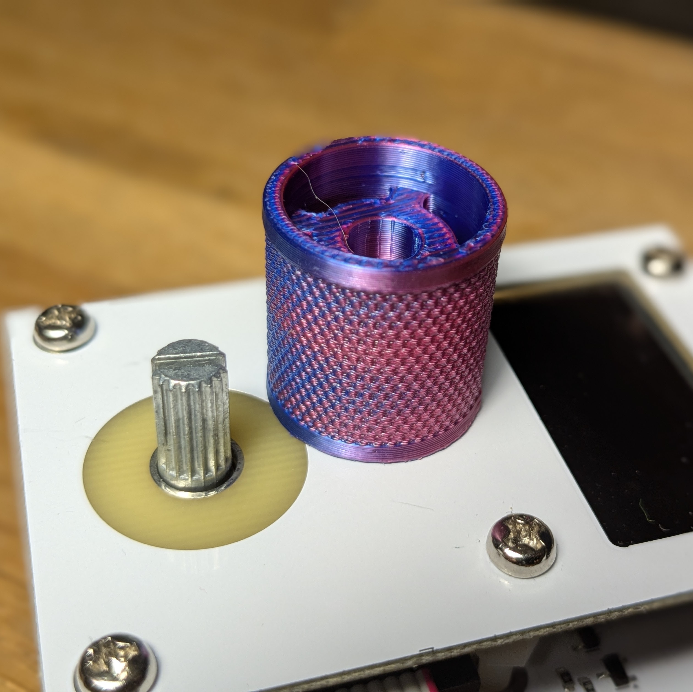
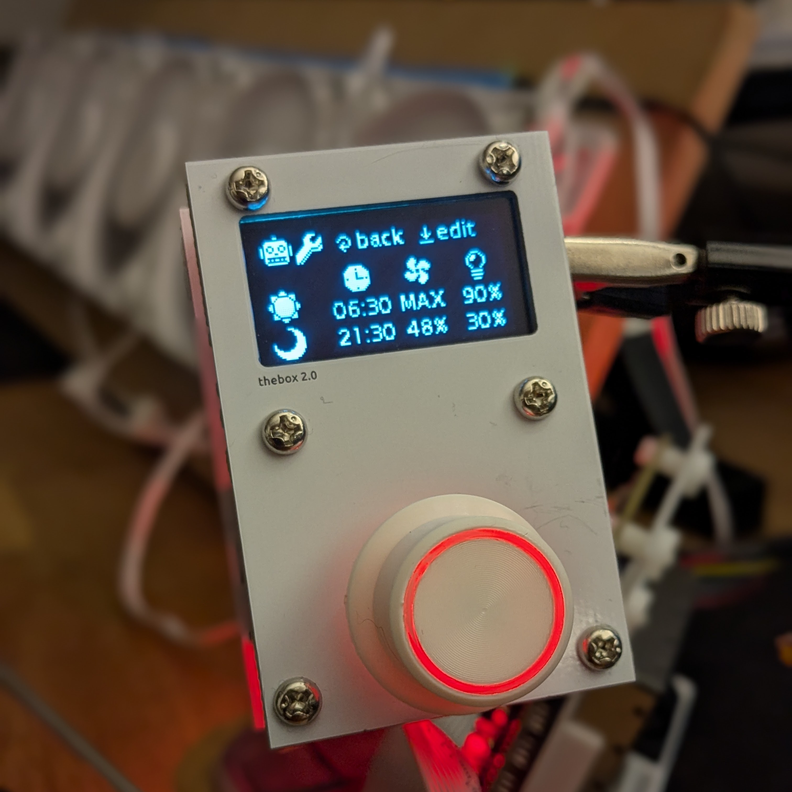
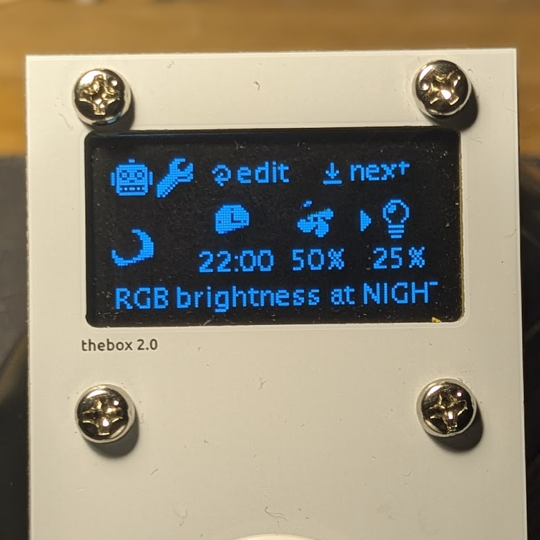

# Home

## What is it?

*thecrbox* is a ready-to-use, drop-in hardware platform that converts a regular *CR box* into a *smart air purifier*.

{ width="128" }
{ width="128" }
{ width="128" }
{ width="128" }
{ width="128" }

## Status

We are currently in the process of releasing diagrams and basic firmware for *thecrbox*.

A small test batch of pre-assembled devices is ready to be shipped and will be made available
as soon as Wi-Fi provisioning and OTA updates are tested.

## Resources

- [schematics](https://github.com/thecrbox/hardware)
- [reference firmware](https://github.com/thecrbox/firmware)
- [this documentation](https://github.com/thecrbox/docs)
