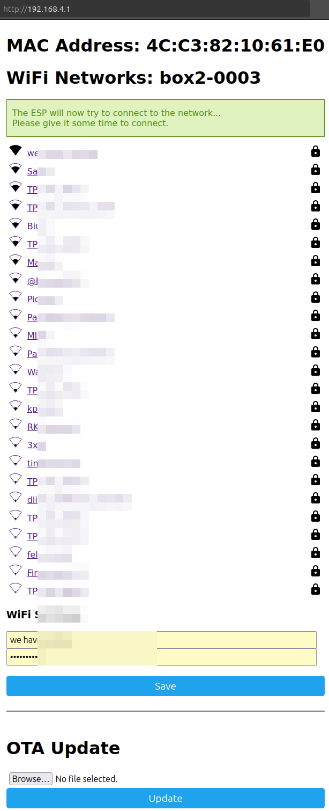

# iPhone, computer or Android (manual via hotspot) { #provisioning-iphone-hotspot }

1. In Wi-Fi settings, join the *box2-XXXX* network (this network has no internet; it’s only for setup)
1. In Safari, open open: [http://192.168.4.1](http://192.168.4.1) (**note:** `http://`, not `https://`)
1. Enter your Wi-Fi name and password, then tap `Save`

Hotspot will be shut down, and your phone should re-connect with your home wifi.

{!provisioning-footer.md!}

