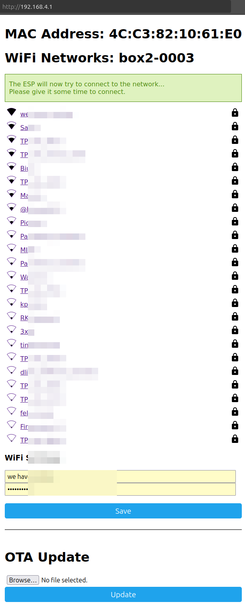

# iPhone, Computer, or Android (Manual via Hotspot) { #provisioning-iphone-hotspot }

1. In your Wi-Fi settings, join the *box2-XXXX* network. This network does not have an internet connection; it is for setup only.
2. In Safari, open [http://192.168.4.1](http://192.168.4.1) (**Note:** Use `http://`, not `https://`).
3. Enter your Wi-Fi name and password, then tap `Save`.

The hotspot will shut down, and your phone should reconnect to your home Wi-Fi network.

{!provisioning-footer.md!}
