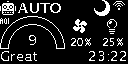
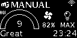

# Quick start { #user-interface }

# Getting started

The new device should be provisioned before it can be used. For more details, see the [provisioning instructions][provisioning].

# Modes of operation

Once provisioned, the following modes can be used:

| Display frame                                 | Mode description                                                        |
|-----------------------------------------------|-------------------------------------------------------------------------|
| { width="192" }     | Fans are off RGBs are off                                           |
| { width="192" }   | Fan speed is controlled automatically RGBs represent AQI level      |
| { width="192" } | Fan speed is set manually RGBs represent AQI level                  |

# Using the encoder

Most day-to-day interactions with _thecrbox_ happen using the encoder:

|                   ⇓ long press                    |                  ↓ short press                   |                    ↺ rotate                     |
|:-------------------------------------------------:|:------------------------------------------------:|:-----------------------------------------------:|
|  { width="192" }  | { width="192" } | { width="192" } |
| switch mode **_AUTO_** / **_MANUAL_** / **_OFF_** |              enter / confirm / next              |              change current value               |

Check the [ui map][ui-map] for a complete guide on how to use the encoder.

# Advanced configuration with the webserver

More advanced options (like _PID_ configuration or RGB light scheme) can be configured using the built-in web server. For detailed information, see [Web Server Configuration](advanced/webserver.md).

# HomeAssistant integration

HomeAssistant integration is available via the [ESPHome integration](https://www.home-assistant.io/integrations/esphome/). For detailed setup instructions, refer to the [ESPHome Integration guide](advanced/esphome.md).
