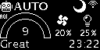
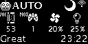
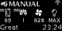

# UI map { #ui-map }

## Mode selection (**_AUTO_**, **_MANUAL_**, **_OFF_**)

!!! note inline

    **⇓ long press**  to switch purifier into next mode

 

??? tip "Available modes list"

    | Step | Display frame                     | Mode descritption                                                       | Encoder action |
    |------|-----------------------------------|-------------------------------------------------------------------------|----------------|
    | 1    |      | Fans are off RGBs are off                                           | ⇓ long press   |
    | 2    |    | Fans speed is controlled automatically RGBs represent AQI level     | ⇓ long press   |
    | 3    |  | Fans speed is set manually RGBs represent AQI level                 | ⇓ long press   |
    | 4    | go to step 1                      |                                                                         |                |
    
    
## **_AUTO_** & **_MANUAL_** mode: selecting sensor data

!!! note inline

    **_↺ rotate_**  to cycle through available sensors data

 

??? tip "**_AUTO_** mode: available sensors list" 

    | Step | Display frame                   | Visible sensor / settings                                                                                                           | Encoder action |
    |------|---------------------------------|-------------------------------------------------------------------------------------------------------------------------------------|----------------|
    | 1    |  | **AQI**(*=9*), **AQI Category**(*=Great*)  fan speed(*=20%*) RGB brightness(*=25%*)                                     | ↺ rotate       |
    | 2    |  | **PM10**(*=2µg/m³*), **PM2.5**(*=2µg/m³*) **AQI Category**(*=Great*)  fan speed(*=20%*) RGB brightness(*=25%*)      | ↺ rotate       |
    | 3    |  | **VOC**(*=53*), **NOX**(*=1*) **AQI Category**(*=Great*)  fan speed(*=20%*) RGB brightness(*=25%*)                  | ↺ rotate       |
    | 4    |  | **temperature**(*=27'C*), **humidity**(*=41%*) **AQI Category**(*=Great*)  fan speed(*=20%*) RGB brightness(*=25%*) | ↺ rotate       |
    | 5    |  | IP address of the **webserver**  fan speed(*=20%*) RGB brightness(*=25%*)                                               | ↺ rotate       |
    | 6    | go to step 1                    |                                                                                                                                     |                |

    Additionally to the sensor value, display always shows current _fans speed_ and _RGBs brightness_.
    In **_AUTO_** mode:
    
    - _fans speed_ is controlled by purifier and depend on the pollution level, and time of day (e.g. lower max _fans speed_ at night)
    - _RGBs brightness_ is controlled by purifier, and depends on time of day (e.g. lower brightness at night)

??? tip "**_MANUAL_** mode: available sensors list"

    | Step | Display frame                     | Visible sensor / settings                                                                                                            | Encoder action |
    |------|-----------------------------------|--------------------------------------------------------------------------------------------------------------------------------------|----------------|
    | 1    |  | **AQI**(*=9*), **AQI Category**(*=Great*) **AQI Category**(*=Great*)  fan speed(*=82%*) RGB brightness(*=100%*)      | ↺ rotate       |
    | 2    |  | **PM10**(*=2µg/m³*), **PM2.5**(*=2µg/m³*) **AQI Category**(*=Great*)  fan speed(*=82%*) RGB brightness(*=100%*)      | ↺ rotate       |
    | 3    |  | **VOC**(*=89*), **NOX**(*=1*) **AQI Category**(*=Great*)  fan speed(*=82%*) RGB brightness(*=100%*)                  | ↺ rotate       |
    | 4    |  | **temperature**(*=27'C*), **humidity**(*=42%*) **AQI Category**(*=Great*)  fan speed(*=82%*) RGB brightness(*=100%*) | ↺ rotate       |
    | 5    |  | IP address of the **webserver**  fan speed(*=82%*) RGB brightness(*=100%*)                                               | ↺ rotate       |
    | 6    | go to step 1                      |                                                                                                                                      |                |

    Additionally to the sensor value, display always shows current _fans speed_ and _RGBs brightness_.
    In **_MANUAL_** mode these values were selected by user and will not change on it's own.

## **_MANUAL_** mode: setting fan speed

!!! note inline

    **_↓ short press_**  **_↺ rotate_**  to change _fan speed_

 

??? tip "Confirming"

    After setting _fans speed_ to desired value you can wait for some time or  **_↓ short press_** **_↓ short press_**  to save fans speed immediately

## **_MANUAL_** mode: setting RGBs brightness

!!! note inline

    **_↓ short press_**  **_↓ short press_**  **_↺ rotate_**  to change _RGBS brightness_

 

??? tip "Confirming"

    After setting _RGBs brightness_ to desired value you can wait for some time or  **_↓ short press_** to save fans speed immediately

